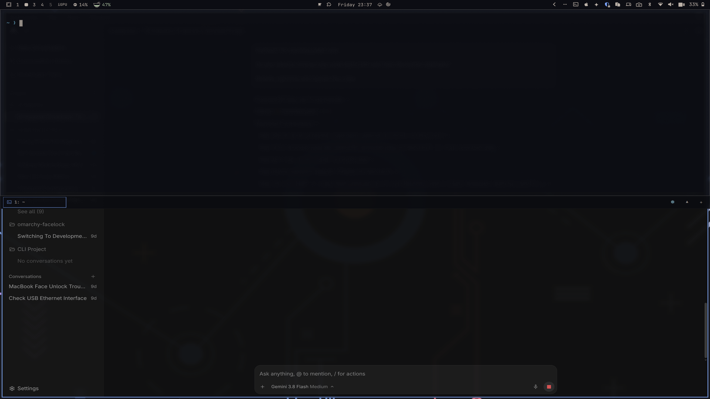

# Omaguake (`bramvanoploo.omaguake`)

An [Omarchy](https://omarchy.org) status bar plugin and drop-down terminal mimicking **Guake** and **Yakuake**.



## Features

- **Dropdown Overlay**:
  - Full-width (100%), 50% screen height by default (configurable).
  - Smooth animated slide-down on summon and slide-up on hide.
  - Automatically hides when focus is lost (clicking outside the terminal window).

- **Tabbed Layout**:
  - Starts with one tab open by default running the user's default Omarchy shell/terminal.
  - Tabs align to the **left**.
  - Tabs bar is horizontally scrollable to accommodate many open sessions.
  - Pinned **`+`** button on the far right of the tab bar to quickly open new tabs.
  - Tab close button (`×`) to terminate and close individual sessions.
  - Configurable tab bar position: **Bottom** (Guake style, default) or **Top** (Yakuake style).

- **Summon Triggers**:
  - Global Keybinding: **`CTRL + SPACE`** (configurable).
  - Trackpad Gestures:
    - **3-finger swipe down**: Show / summon terminal.
    - **3-finger swipe up**: Hide / dismiss terminal.
    - *Only enabled if these gestures haven't already been configured.*

- **Smart Conflict Validation**:
  - When configuring keybindings, Omaguake checks against active Hyprland bindings and Omarchy shortcuts.
  - If a conflict is detected, the user is **blocked from applying** it, with a clear explanation of what action or application owns the shortcut.
  - Trackpad gestures are checked against existing gestures and 3-finger drag (`drag_3fg`) configurations.

- **Status Bar Integration**:
  - Status bar widget with terminal icon.
  - **Left-click**: Toggle Omaguake dropdown terminal.
  - **Right-click**: Open the plugin configuration overlay.

## Installation

   ```bash
   omarchy plugin add https://github.com/bramvanoploo/omaguake.git --enable
   ```

## Installation

   ```bash
   omarchy plugin add https://github.com/bramvanoploo/omaguake.git --enable
   ```

## Uninstall

  1. Remove the plugin
  
   ```bash
   omarchy plugin remove bramvanoploo.omaguake
   ```

  2. Remove the custom bindings from `~/.config/hypr/bindings.lua`
  ```lua
  -- BEGIN bramvanoploo.omaguake
  ....
  -- END bramvanoploo.omaguake
  ```

## Configuration

Right-click the Omaguake bar icon to open the configuration overlay:
- **Height**: Adjust dropdown panel height (20% – 100%).
- **Tabs Position**: Choose between Bottom (Guake) or Top (Yakuake).
- **Keybinding**: Enter any key chord; live validation alerts if the chord is already bound.
- **Trackpad Gestures**: Toggle 3-finger swipe gestures; alerts if gestures conflict with other settings.
- **Auto-hide**: Toggle auto-hide on focus loss.

## License

MIT © Bram van Oploo
